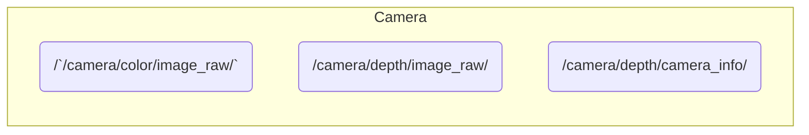

# mediapipe_ros2
[](https://docs.ros.org/en/humble/)

## 📦 Features
Node & Topic


## 🛠️ Setup
### Setup Camera ([Astra Pro](https://www.orbbec.com/products/structured-light-camera/astra-series/))

Please follow link  
[ros2_astra_camera](https://github.com/orbbec/ros2_astra_camera.git)

### Installing dependent packages
Install python packages
```bash
pip3 install -U "numpy==1.26.4" "opencv-python==4.10.0.84"
pip3 install opencv-python mediapipe
```
Install ros packages
```bash
sudo apt install ros-humble-cv-bridge
sudo apt install ros-humble-image-transport
sudo apt install ros-humble-message-filters
```
### Setup mediapipe_ros2 Repositories
Clone
```bash
cd ~/ros2_ws/src
git clone https://github.com/iHaruruki/mediapipe_ros2.git
```
Build
```bash
cd ~/ros2_ws
colcon build --symlink-install --packages-select mediapipe_ros2
source install/setup.bash
```

## 🎮 How to use
### Launch Camera
```bash
ros2 launch astra_camera astra_pro.launch.xml 
```
### Run face_mesh_node
```bash
ros2 run mediapipe_ros2 face_mesh_node
```
### Run Holistic node (human pose, face landmarks, hand tracking)
```bash
ros2 run mediapipe_ros2 holistic_pose_node
```
rviz2 
```bash
ros2 launch mediapipe_ros2 rviz.launch.py 
```

## 👤 Authors

- **[iHaruruki](https://github.com/iHaruruki)** — Main author & maintainer

## 📚 Reference
- [MediaPipe](https://chuoling.github.io/mediapipe/)
- [Mermaid](https://mermaid.js.org/)

## 📜 License
The source code is licensed MIT. Please see LICENSE.