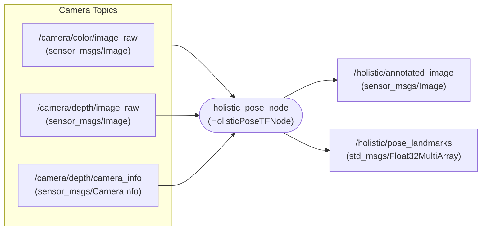

# mediapipe_ros2
[](https://docs.ros.org/en/humble/)

## 📦 Features
Node & Topic


## 🛠️ Setup
### Setup Camera ([Astra Pro](https://www.orbbec.com/products/structured-light-camera/astra-series/))
Please follow link  
[ros2_astra_camera](https://github.com/orbbec/ros2_astra_camera.git)

### Installing dependent packages
Install python packages
```bash
pip3 install -U "numpy==1.26.4" "opencv-python==4.10.0.84"
pip3 install opencv-python mediapipe
```
Install ros packages
```bash
sudo apt install ros-humble-cv-bridge
sudo apt install ros-humble-image-transport
sudo apt install ros-humble-message-filters
```
### Setup mediapipe_ros2 Repositories
Clone
```bash
cd ~/ros2_ws/src
git clone https://github.com/iHaruruki/mediapipe_ros2.git
```
Build
```bash
cd ~/ros2_ws
colcon build --symlink-install --packages-select mediapipe_ros2
source install/setup.bash
```

## 🎮 How to use
### Launch Camera
Astra Pro
```bash
ros2 launch astra_camera astra_pro.launch.xml 
```
Astra Stereo S U3
```bash
ros2 launch orbbec_camera astra_stereo_u3.launch.py
```
> [!NOTE]
> If your camera setup in not complete, please refer to the link below.
> [Astra Pro]()
> [Astra Stereo S U3]()

### Run face_mesh_node (face landmarks only)
```bash
ros2 run mediapipe_ros2 face_mesh_node
```
### Run Holistic node (human pose, face landmarks, hand tracking)
Launch `holistic_pose_node` & `rviz`
```bash
ros2 launch mediapipe_ros2 posture.launch.py
```
Subscribe topic(/holistic/pose_landmarks)
```bash
ros2 run mediapipe_ros2 subscribe_landmark_node
```
> [!TIP]
> This is a sample node that subscribes to the `/holistic/pose_landmarks`  
> 骨格のランドマークを購読するサンプルプログラムです

## 👤 Authors

- **[iHaruruki](https://github.com/iHaruruki)** — Main author & maintainer

## 📚 Reference
Mediapipe Face Mesh
- [MediaPipe](https://chuoling.github.io/mediapipe/)
- [顔ランドマーク検出ガイド](https://ai.google.dev/edge/mediapipe/solutions/vision/face_landmarker?utm_source=chatgpt.com)
- [468点の3Dランドマーク。基礎解説](https://mediapipe.readthedocs.io/en/latest/solutions/face_mesh.html?utm_source=chatgpt.com)
- [Face Meshの実務的使い方](https://samproell.io/posts/yarppg/yarppg-face-detection-with-mediapipe/?utm_source=chatgpt.com)

MediaPipe Holistic
- [MediaPipe](https://chuoling.github.io/mediapipe/)
- [Holistic Landmarker](https://ai.google.dev/edge/mediapipe/solutions/vision/holistic_landmarker?utm_source=chatgpt.com)
- [Holistic のトポロジ・リアルタイム性の解説](https://research.google/blog/mediapipe-holistic-simultaneous-face-hand-and-pose-prediction-on-device/?utm_source=chatgpt.com)

MediaPipe Pose
- [Pose Landmarker ガイド](https://ai.google.dev/edge/mediapipe/solutions/vision/pose_landmarker?utm_source=chatgpt.com)


ROS 2 message_filters
- [message_filters](https://docs.ros.org/en/rolling/p/message_filters/doc/index.html)
- [ROS 2（rolling）のPythonチュートリアル](https://docs.ros.org/en/rolling/p/message_filters/doc/Tutorials/Approximate-Synchronizer-Python.html?utm_source=chatgpt.com)

CV Bridge
- [CvBridge公式チュートリアル](https://wiki.ros.org/cv_bridge/Tutorials/ConvertingBetweenROSImagesAndOpenCVImagesPython?utm_source=chatgpt.com)
- [image_pipeline](https://docs.ros.org/en/rolling/p/image_pipeline/camera_info.html)

tf2_ros / TransformBroadcaster（Python）
- [Pythonブロードキャスタの実装](https://docs.ros.org/en/foxy/Tutorials/Intermediate/Tf2/Writing-A-Tf2-Broadcaster-Py.html?utm_source=chatgpt.com)
- [tf2（ROS1）チュートリアル](https://wiki.ros.org/tf2/Tutorials/Writing%20a%20tf2%20broadcaster%20%28Python%29?utm_source=chatgpt.com)

Mermaid
- [Mermaid公式](https://mermaid.js.org/)

## 📜 License
The source code is licensed MIT. Please see LICENSE.