# mediapipe_ros2
[](https://docs.ros.org/en/humble/)

## 📦 Features
Node & Topic

```mermaid
flowchart LR
  %% Camera Node
  CARERA([/camera/camera])
  TF(/tf)

  %% ---------- Input topics ----------
  subgraph Camera Topics
    CIMG["/camera/color/image_raw<br/>(sensor_msgs/Image)"]
    DIMG["/camera/depth/image_raw<br/>(sensor_msgs/Image)"]
    DINFO["/camera/depth/camera_info<br/>(sensor_msgs/CameraInfo)"]
  end

  CARERA --> CIMG
  CARERA --> DIMG
  CARERA --> DINFO
  CARERA --> TF

  %% ---------- Node ----------
  NODE([/holistic_pose_node])

  CIMG --> NODE
  DIMG --> NODE
  DINFO --> NODE
  NODE --> TF

  %% ---------- Output topics ----------
  subgraph Holistic Topics
    ANN["/holistic/annotated_image<br/>(sensor_msgs/Image)<br/>(Landmarkを描き込んだ画像（BGR）)"]
    LM["/holistic/pose_landmarks<br/>(std_msgs/Float32MultiArray)(2Dランドマーク列)"]
    CSV["/holistic/pose/landmarks/csv<br/>(mediapipe_ros2_msgs/PoseLandmark)(CSV用ランドマーク列)"]
  end

  NODE --> ANN
  NODE --> LM
  NODE --> CSV
```


## 🛠️ Setup
### Setup Camera ([Astra Pro](https://www.orbbec.com/products/structured-light-camera/astra-series/))
Please follow link  
[ros2_astra_camera](https://github.com/orbbec/ros2_astra_camera.git)

### Installing dependent packages
#### Install python packages
```bash
pip3 install -U "numpy==1.26.4" "opencv-python==4.10.0.84"
pip3 install opencv-python mediapipe
```
#### Install ros packages
```bash
sudo apt install ros-humble-cv-bridge
sudo apt install ros-humble-image-transport
sudo apt install ros-humble-message-filters
```
### Setup mediapipe_ros2 Repositories
#### Clone
```bash
cd ~/ros2_ws/src
git clone https://github.com/iHaruruki/mediapipe_ros2.git
git clone https://github.com/iHaruruki/mediapipe_ros2_msgs.git
```
#### Build
First, build the message definition package.
```bash
cd ~/ros2_ws
colcon build --symlink-install --packages-select mediapipe_ros2_msgs
source install/setup.bash
```
Second, build the `mediapipe_ros2` package.
```bash
cd ~/ros2_ws
colcon build --symlink-install --packages-select mediapipe_ros2
source install/setup.bash
```

## 🎮 How to use
### :camera: Launch Camera
Astra Pro
```bash
ros2 launch astra_camera astra_pro.launch.xml 
```
Astra Stereo S U3
```bash
ros2 launch orbbec_camera astra_stereo_u3.launch.py
```
> [!NOTE]
> If your camera setup in not complete, please refer to the link below.  
> [Astra Pro](https://github.com/iHaruruki/ros2_astra_camera.git)  
> [Astra Stereo S U3](https://github.com/iHaruruki/OrbbecSDK_ROS2.git)  

### Run Holistic node (human pose, face landmarks, hand tracking)
#### Launch `holistic_pose_node` & `rviz`
```bash
ros2 launch mediapipe_ros2 posture.launch.py
```
#### ros2 topic echo / topicが公開しているデータを表示
```bash
# ros2 topic echo [topic name]
ros2 topic echo /holistic/pose_landmarks/csv
```
#### Output to csv file / CSVファイルに出力
`~/landmark_data.csv`にCSVファイルが生成される
```bash
ros2 run mediapipe_ros2 subscribe_landmark_node
```
csv format
```
stamp_sec,stamp_nanosec,frame_id,landmark_name,index,x_px,y_px
```
| stamp_sec | stamp_nanosec | frame_id | landmark_name | index | x_px | y_px |
| --- | --- | --- | --- | --- | --- | --- |
| ROS Header.stamp.sec（秒）| ROS Header.stamp.nanosec（ナノ秒）| ROS Header.frame_id（座標系。例: camera_color_optical_frame）| ランドマーク名（例: left_thumb, right_ankle）| ランドマークのインデックス（MediaPipe Poseの0..32）| 画像のフル座標系におけるピクセルx（左→右）| 画像のフル座標系におけるピクセルy（上→下）|

### ROS 2 package create / ROS 2 パッケージ作成の方法
`/holistic/pose/landmarks/csv` topicをsubscribeして表示するパッケージを作成する

#### Create a package
```bash
cd ~/ros2_ws/src
```
```bash
# ros2 pkg create --build-type ament_cmake <package_name>
ros2 pkg create --build-type ament_cmake mediapipe_pkg
```
#### Build a package
```bash
cd ~/ros2_ws
```
```bash
colcon build --packages-select mediapipe_pkg
```
#### Source the setup
```bash
source install/local_setup.bash
```
### Write source file
`mani.cpp`
```cpp
// Copyright (c) 2025 Haruki Isono
// This software is released under the MIT License, see LICENSE.

#include <rclcpp/rclcpp.hpp>
#include <mediapipe_ros2_msgs/msg/pose_landmark.hpp>
#include <map>
#include <vector>
#include <mutex>
#include <string>
#include <iomanip>
#include <sstream>
#include <algorithm>
#include <cmath>

struct LandmarkData
{
    int index;
    std::string name;
    double x;
    double y;
    rclcpp::Time timestamp;
    std::string frame_id;
};

class LandmarkCSVViewer : public rclcpp::Node
{
public:
    explicit LandmarkCSVViewer()
    : Node("landmark_csv_viewer"),
      total_frames_processed_(0),
      incomplete_frames_(0),
      total_messages_received_(0)
    {
        // Parameters
        this->declare_parameter<std::string>("topic_name", "/holistic/pose/landmarks/csv");
        this->declare_parameter<double>("frame_timeout", 0.5);
        this->declare_parameter<int>("expected_landmarks", 33);
        this->declare_parameter<bool>("display_all_landmarks", false);
        this->declare_parameter<bool>("display_statistics", true);

        this->get_parameter("topic_name", topic_name_);
        this->get_parameter("frame_timeout", frame_timeout_);
        this->get_parameter("expected_landmarks", expected_landmarks_);
        this->get_parameter("display_all_landmarks", display_all_landmarks_);
        this->get_parameter("display_statistics", display_statistics_);

        // Subscriber
        landmark_sub_ = this->create_subscription<mediapipe_ros2_msgs::msg::PoseLandmark>(
            topic_name_,
            rclcpp::QoS(100).reliable(),
            std::bind(&LandmarkCSVViewer::landmarkCallback, this, std::placeholders::_1)
        );

        // Timer for processing completed frames (10 Hz)
        process_timer_ = this->create_wall_timer(
            std::chrono::milliseconds(100),
            std::bind(&LandmarkCSVViewer::processCompleteFrames, this)
        );

        // Timer for statistics (every 5 seconds)
        if (display_statistics_) {
            stats_timer_ = this->create_wall_timer(
                std::chrono::seconds(5),
                std::bind(&LandmarkCSVViewer::printStatistics, this)
            );
        }

        RCLCPP_INFO(this->get_logger(), "Landmark CSV Viewer started");
        RCLCPP_INFO(this->get_logger(), "  - Topic: %s", topic_name_.c_str());
        RCLCPP_INFO(this->get_logger(), "  - Expected landmarks: %d", expected_landmarks_);
        RCLCPP_INFO(this->get_logger(), "  - Frame timeout: %.2f s", frame_timeout_);
        RCLCPP_INFO(this->get_logger(), "  - Display all landmarks: %s", 
                    display_all_landmarks_ ? "true" : "false");
    }

private:
    void landmarkCallback(const mediapipe_ros2_msgs::msg::PoseLandmark::SharedPtr msg)
    {
        std::lock_guard<std::mutex> lock(buffer_mutex_);

        total_messages_received_++;

        // Create timestamp key
        std::string timestamp_key = getTimestampKey(msg->header.stamp);

        // Create landmark data
        LandmarkData landmark;
        landmark.index = msg->index;
        landmark.name = msg->name;
        landmark.x = msg->x;
        landmark.y = msg->y;
        landmark.timestamp = rclcpp::Time(msg->header.stamp);
        landmark.frame_id = msg->header.frame_id;

        // Add to frame buffer
        frame_buffer_[timestamp_key][msg->index] = landmark;
        frame_timestamps_[timestamp_key] = this->now();

        // Update index statistics
        index_stats_[msg->index]++;
    }

    void processCompleteFrames()
    {
        std::lock_guard<std::mutex> lock(buffer_mutex_);

        auto current_time = this->now();
        std::vector<std::string> completed_frames;

        // Check for complete or timed-out frames
        for (const auto & [timestamp_key, landmarks] : frame_buffer_) {
            auto last_update = frame_timestamps_[timestamp_key];
            bool frame_complete = landmarks.size() >= static_cast<size_t>(expected_landmarks_);
            bool frame_timeout = (current_time - last_update).seconds() > frame_timeout_;

            if (frame_complete || frame_timeout) {
                completed_frames.push_back(timestamp_key);

                // Display frame
                displayFrame(timestamp_key, landmarks);

                // Update statistics
                total_frames_processed_++;
                if (!frame_complete) {
                    incomplete_frames_++;
                }
            }
        }

        // Remove processed frames from buffer
        for (const auto & key : completed_frames) {
            frame_buffer_.erase(key);
            frame_timestamps_.erase(key);
        }
    }

    void displayFrame(const std::string & timestamp_key,
                     const std::map<int, LandmarkData> & landmarks)
    {
        if (landmarks.empty()) {
            return;
        }

        // Get first landmark for header info
        const auto & first_landmark = landmarks.begin()->second;

        RCLCPP_INFO(this->get_logger(), "========================================");
        RCLCPP_INFO(this->get_logger(), "Frame: %s", timestamp_key.c_str());
        RCLCPP_INFO(this->get_logger(), "Frame ID: %s", first_landmark.frame_id.c_str());
        RCLCPP_INFO(this->get_logger(), "Landmarks received: %zu / %d", 
                    landmarks.size(), expected_landmarks_);

        if (display_all_landmarks_) {
            // Display all landmarks in order
            RCLCPP_INFO(this->get_logger(), "----------------------------------------");
            RCLCPP_INFO(this->get_logger(), "Index | Name           | X        | Y");
            RCLCPP_INFO(this->get_logger(), "----------------------------------------");

            for (int i = 0; i < expected_landmarks_; ++i) {
                auto it = landmarks.find(i);
                if (it != landmarks.end()) {
                    const auto & lm = it->second;
                    if (std::isfinite(lm.x) && std::isfinite(lm.y)) {
                        RCLCPP_INFO(this->get_logger(), "%5d | %-14s | %8.2f | %8.2f",
                                    lm.index, lm.name.c_str(), lm.x, lm.y);
                    } else {
                        RCLCPP_INFO(this->get_logger(), "%5d | %-14s | %8s | %8s",
                                    lm.index, lm.name.c_str(), "nan", "nan");
                    }
                } else {
                    RCLCPP_INFO(this->get_logger(), "%5d | %-14s | %8s | %8s",
                                i, "MISSING", "nan", "nan");
                }
            }
        } else {
            // Display only detected landmarks summary
            std::vector<int> detected_indices;
            std::vector<int> missing_indices;

            for (int i = 0; i < expected_landmarks_; ++i) {
                if (landmarks.find(i) != landmarks.end()) {
                    detected_indices.push_back(i);
                } else {
                    missing_indices.push_back(i);
                }
            }

            if (!detected_indices.empty()) {
                std::stringstream ss;
                ss << "Detected indices (" << detected_indices.size() << "): ";
                for (size_t i = 0; i < std::min(detected_indices.size(), size_t(10)); ++i) {
                    ss << detected_indices[i];
                    if (i < detected_indices.size() - 1) ss << ", ";
                }
                if (detected_indices.size() > 10) {
                    ss << ", ... (+" << (detected_indices.size() - 10) << " more)";
                }
                RCLCPP_INFO(this->get_logger(), "%s", ss.str().c_str());
            }

            if (!missing_indices.empty() && missing_indices.size() <= 10) {
                std::stringstream ss;
                ss << "Missing indices (" << missing_indices.size() << "): ";
                for (size_t i = 0; i < missing_indices.size(); ++i) {
                    ss << missing_indices[i];
                    if (i < missing_indices.size() - 1) ss << ", ";
                }
                RCLCPP_INFO(this->get_logger(), "%s", ss.str().c_str());
            } else if (!missing_indices.empty()) {
                RCLCPP_INFO(this->get_logger(), "Missing indices: %zu", missing_indices.size());
            }
        }

        RCLCPP_INFO(this->get_logger(), "========================================\n");
    }

    void printStatistics()
    {
        std::lock_guard<std::mutex> lock(buffer_mutex_);

        RCLCPP_INFO(this->get_logger(), "======== Statistics ========");
        RCLCPP_INFO(this->get_logger(), "Total messages received: %lu", total_messages_received_);
        RCLCPP_INFO(this->get_logger(), "Frames processed: %lu", total_frames_processed_);
        RCLCPP_INFO(this->get_logger(), "Incomplete frames: %lu", incomplete_frames_);
        RCLCPP_INFO(this->get_logger(), "Frames in buffer: %zu", frame_buffer_.size());

        // Find min/max received indices
        if (!index_stats_.empty()) {
            uint64_t min_count = UINT64_MAX;
            uint64_t max_count = 0;
            std::vector<int> missing_indices;

            for (int i = 0; i < expected_landmarks_; ++i) {
                if (index_stats_.find(i) == index_stats_.end() || index_stats_[i] == 0) {
                    missing_indices.push_back(i);
                } else {
                    min_count = std::min(min_count, index_stats_[i]);
                    max_count = std::max(max_count, index_stats_[i]);
                }
            }

            RCLCPP_INFO(this->get_logger(), "Index stats - Min: %lu, Max: %lu", 
                        min_count, max_count);

            if (!missing_indices.empty()) {
                std::stringstream ss;
                ss << "Never received indices: ";
                for (size_t i = 0; i < std::min(missing_indices.size(), size_t(20)); ++i) {
                    ss << missing_indices[i];
                    if (i < missing_indices.size() - 1) ss << ", ";
                }
                if (missing_indices.size() > 20) {
                    ss << ", ... (+" << (missing_indices.size() - 20) << " more)";
                }
                RCLCPP_WARN(this->get_logger(), "%s", ss.str().c_str());
            }
        }

        RCLCPP_INFO(this->get_logger(), "============================\n");
    }

    std::string getTimestampKey(const builtin_interfaces::msg::Time & stamp) const
    {
        std::stringstream ss;
        ss << stamp.sec << "_" << stamp.nanosec;
        return ss.str();
    }

    // Subscriber
    rclcpp::Subscription<mediapipe_ros2_msgs::msg::PoseLandmark>::SharedPtr landmark_sub_;

    // Timers
    rclcpp::TimerBase::SharedPtr process_timer_;
    rclcpp::TimerBase::SharedPtr stats_timer_;

    // Frame buffer
    std::map<std::string, std::map<int, LandmarkData>> frame_buffer_;
    std::map<std::string, rclcpp::Time> frame_timestamps_;
    std::mutex buffer_mutex_;

    // Parameters
    std::string topic_name_;
    double frame_timeout_;
    int expected_landmarks_;
    bool display_all_landmarks_;
    bool display_statistics_;

    // Statistics
    uint64_t total_frames_processed_;
    uint64_t incomplete_frames_;
    uint64_t total_messages_received_;
    std::map<int, uint64_t> index_stats_;
};

int main(int argc, char ** argv)
{
    rclcpp::init(argc, argv);
    auto node = std::make_shared<LandmarkCSVViewer>();
    rclcpp::spin(node);
    rclcpp::shutdown();
    return 0;
}
```

## 👤 Authors

- **[iHaruruki](https://github.com/iHaruruki)** — Main author & maintainer

## 📚 Reference
Mediapipe Face Mesh
- [MediaPipe](https://chuoling.github.io/mediapipe/)
- [顔ランドマーク検出ガイド](https://ai.google.dev/edge/mediapipe/solutions/vision/face_landmarker?utm_source=chatgpt.com)
- [468点の3Dランドマーク。基礎解説](https://mediapipe.readthedocs.io/en/latest/solutions/face_mesh.html?utm_source=chatgpt.com)
- [Face Meshの実務的使い方](https://samproell.io/posts/yarppg/yarppg-face-detection-with-mediapipe/?utm_source=chatgpt.com)

MediaPipe Holistic
- [MediaPipe](https://chuoling.github.io/mediapipe/)
- [Holistic Landmarker](https://ai.google.dev/edge/mediapipe/solutions/vision/holistic_landmarker?utm_source=chatgpt.com)
- [Holistic のトポロジ・リアルタイム性の解説](https://research.google/blog/mediapipe-holistic-simultaneous-face-hand-and-pose-prediction-on-device/?utm_source=chatgpt.com)

MediaPipe Pose
- [Pose Landmarker ガイド](https://ai.google.dev/edge/mediapipe/solutions/vision/pose_landmarker?utm_source=chatgpt.com)


ROS 2 message_filters
- [message_filters](https://docs.ros.org/en/rolling/p/message_filters/doc/index.html)
- [ROS 2（rolling）のPythonチュートリアル](https://docs.ros.org/en/rolling/p/message_filters/doc/Tutorials/Approximate-Synchronizer-Python.html?utm_source=chatgpt.com)

CV Bridge
- [CvBridge公式チュートリアル](https://wiki.ros.org/cv_bridge/Tutorials/ConvertingBetweenROSImagesAndOpenCVImagesPython?utm_source=chatgpt.com)
- [image_pipeline](https://docs.ros.org/en/rolling/p/image_pipeline/camera_info.html)

tf2_ros / TransformBroadcaster（Python）
- [Pythonブロードキャスタの実装](https://docs.ros.org/en/foxy/Tutorials/Intermediate/Tf2/Writing-A-Tf2-Broadcaster-Py.html?utm_source=chatgpt.com)
- [tf2（ROS1）チュートリアル](https://wiki.ros.org/tf2/Tutorials/Writing%20a%20tf2%20broadcaster%20%28Python%29?utm_source=chatgpt.com)

Mermaid
- [Mermaid公式](https://mermaid.js.org/)

## 📜 License
The source code is licensed MIT. Please see LICENSE.